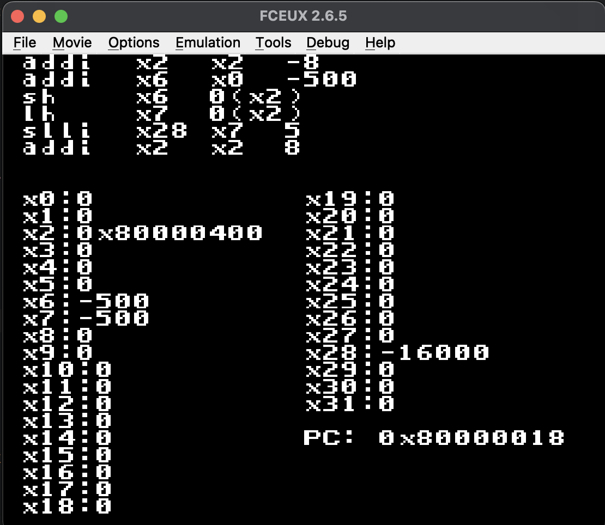
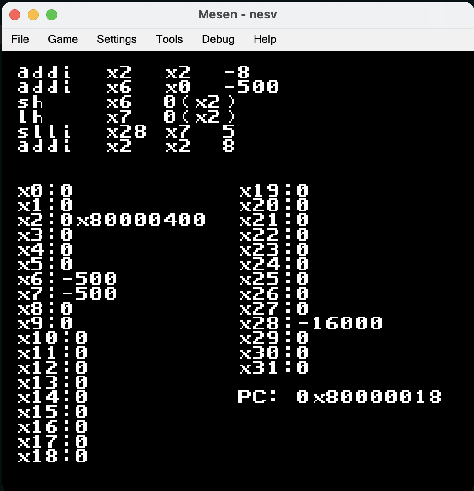

# nesv
**nesv** is a toy RISC-V emulator that runs entirely on the **Nintendo Entertainment System (NES)**, written in C (compiled with [cc65](https://cc65.github.io/)), demonstrates that a modern 32-bit ISA can be emulated on 8-bit retro hardware.

 

## why?
The fun idea of running a modern 32-bit ISA on an 8-bit 80s console.

Playing with RISC-V’s 32-bit address space while living inside the NES’s 2 KB of RAM is an absurd but educational exercise.

It’s a mash-up of computer history: late-70s 6502 meets modern 2010s RISC-V.

It’s completely impractical, but that’s exactly what makes it fun: seeing RISC-V assembly actually run on NES hardware.

## Features
- Supports core `RV32I` instructions: `arithmetic`, `logical`, `loads/stores`, and `branches`.

- Simple bus abstraction for memory access (NES RAM mapped as RISC-V memory).

- Debug text renderer: NES screen shows registers, PC, and instructions on `DEBUG` mode.

- Runs test RISC-V binaries embedded in ROM.

## Building
To build and run, you’ll need the following tools:

- [`cc65`](https://cc65.github.io/) cross development toolchain
- `NES` emulator (e.g., FCEUX)

### Normal Build
```bash
➜ ~ make  
```
### DEBUG Build
```bash
➜ ~ make DEBUG=1  
```

## License
This project is licensed under the BSD 3-Clause License. See the LICENSE file for details.
