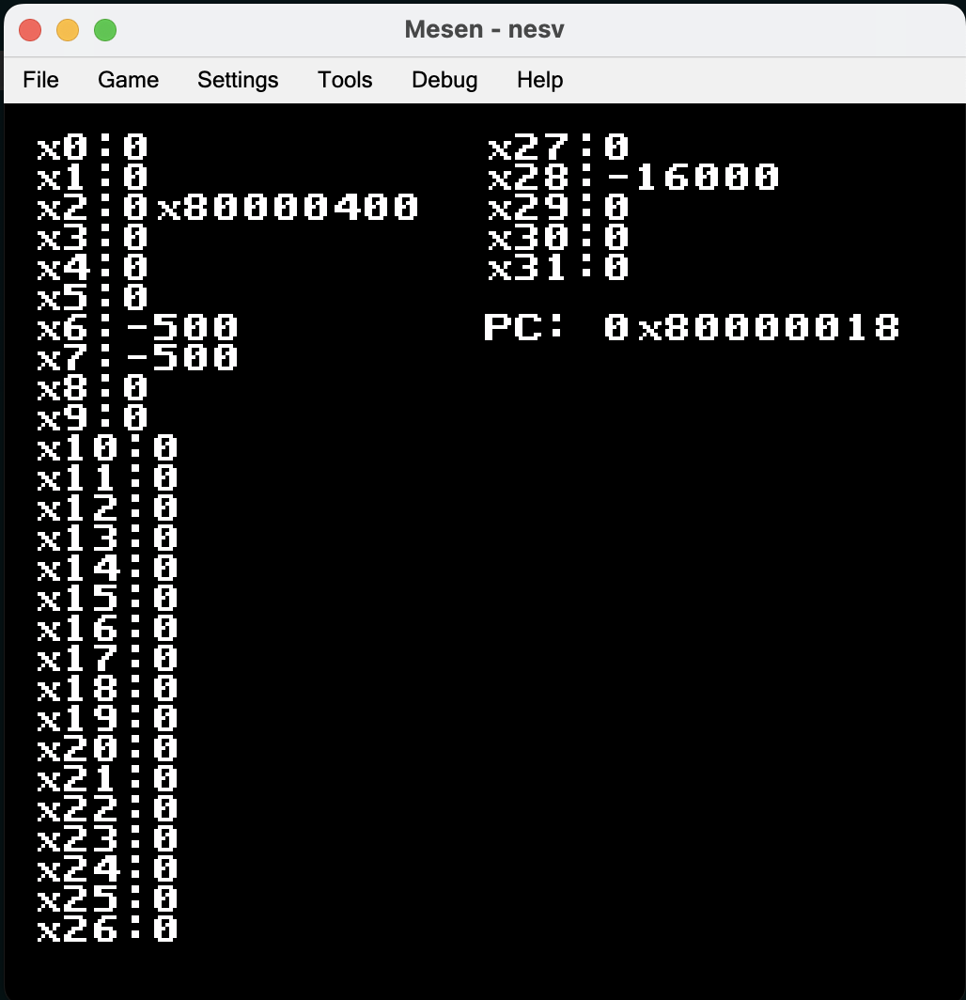

# nesv
**nesv** is a toy RISC-V emulator that runs entirely on the **Nintendo Entertainment System (NES)**, demonstrates that a modern 32-bit ISA can be emulated on 8-bit retro hardware.

Only `RV32I` base instruction set,`branch`, `load/store`, and `arithmetic/logical` (no compressed, no floating point, no atomics). Performance is limited by the 6502 CPU speed (1.79 MHz). Instruction decoder is minimal, just enough to run demos. No support for interrupts, traps, or a full RISC-V environment.

## Building
To build and run, you’ll need the following tools:

- [`cc65`](https://cc65.github.io/) cross development package
- `NES` emulator (e.g., FCEUX)

## License
This project is licensed under the BSD 3-Clause License. See the LICENSE file for details.
